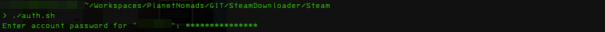
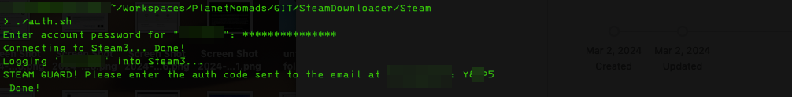
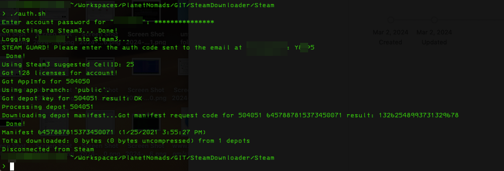
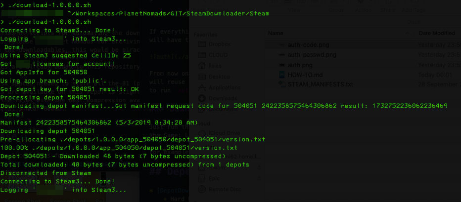

# Planet Nomads :: Steam Downloader

Scripts for downloading previous releases of Planet Nomads.


## Installation Instructions

### Depot Downloader

Download the latest release from https://github.com/SteamRE/DepotDownloader/releases .

If you are stuck on an older version of MacOS (like me, on Mojave due 32 bits support), download the [2.5.0 release](https://github.com/SteamRE/DepotDownloader/releases/tag/DepotDownloader_2.5.0).

Install the latest Mono or [.NET](https://dotnet.microsoft.com/en-us/download/dotnet) release. Or [5.0.408](https://dotnet.microsoft.com/en-us/download/dotnet/5.0) if you are on Mojave.

### 7-Zip

Without it, it will be pretty cumbersome to archive all that binaries.

Install it using the install method for your rig (macpots, apt, chocolatey, wathever).


## Configuring

After checking out this repo, let's say on `Workspaces/PlanetNomads/GIT/SteamDownloader` like I did, open your shell and:

```
cd ~/Workspaces/PlanetNomads/GIT/SteamDownloader
cd Steam
vi .common.inc
```

This will edit the file [Steam/.common.inc](https://github.com/net-lisias-pn/SteamDownloader/blob/master/Steam/.common.inc) - but you can use any text editor you would prefer.

You need to configure your Steam username on the `USER` variable, and the `RUNTIME` and `CMD` accordingly your setup.

```
RUNTIME=/usr/local/share/dotnet/dotnet
CMD=~/bin/depotdownloader/DepotDownloader.dll

USER=<your-steamuser-here>

<yada yada yada>
```

On `CMD`, the full pathname to the `DepotDownloader`'s DLL . You will notice that I installed mine on a directory called `bin` on my `$HOME` directory.

You will need to set the `RUNTIME` to the `dotnet` executable from the SDK. I didn't checked on Linux, but I think it should be on the same path.


## Using

### Authenticating

Open your shell and:

```
cd ~/Workspaces/PlanetNomads/GIT/SteamDownloader
cd Steam
./auth.sh
```

If everything is correctly configured, this will authenticate you on Steam as follows.

You will need to type your steam password as follows:



This is the `DepotDownloader`, not the script - I do not have access to this password, rest assured.

Steam will send you an email with an authentication code. You will need to get that code and type it as shown below:



If everything is properly configured and you didn't err the auth code, you will have the following text on your console:



From now on, you will not have to retype the password - the download scripts will reuse the current auth session until it expires, when so you will have to run `auth.sh` again.

### Downloading

Just run the desired release script. It will download all the 3 depots for the Game: Linux, MacOS and Windows.

For example, if you want to download the `1.0.0.0` PN version:



And so goes on.

If the download gets interrupted, just run the same script again. It will continue from where it stopped.

You can also validate the download contents by running the script again after all is finished. Remember do run `auth.sh` if you decide to validate the download some time after downloading it, as the Steam auth will be expired for sure.

### Compressing

After downloading whatever you want, you will probably want to compress everything to save some space.

You can use whatever you want, from PK-ZIP to `tar.gz`, but the best cost/benefit I got was from `7z`. 

You will find a script called `pack_it_all.sh` inside the `depots` directory. Just run it and it will find and compress everything on that directory.

Don't do that while downloading.

Once a `.7z` file is found, the respective depot is ignored. If by any reason the process fail, you will need to delete the `.7z` files and start again.

Be advised: this is a terribly intensive CPU and memory process, got watch a movie or play a videogame somewhere else - this is going to take a while.


## Dependencies

* [DepotDownloader](https://github.com/SteamRE/DepotDownloader/releases)
	+ Hard Dependency 
	+ Not Included
* [7-zip](https://www.7-zip.org/)
	+ For compression
	+ Not Included
